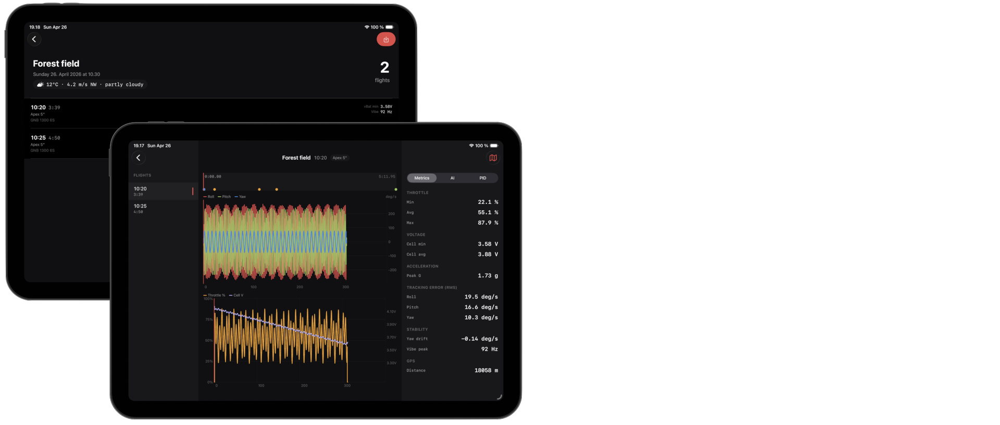

# Quadr.

iPadOS app for FPV drone pilots.

After a flying session you plug your flight controller into the iPad and Quadr pulls the blackbox flight logs off it. Then you get charts of throttle, gyro, battery sag, PID behavior — basically a flight review on the device, no laptop needed at the field.

Built for Betaflight FCs (STM32-based, talks USB CDC-ACM serial). Works over USB-C via DriverKit, and over Bluetooth as a fallback if your FC has a SpeedyBee BT adapter or similar.

Status: pre-release, in active development.
