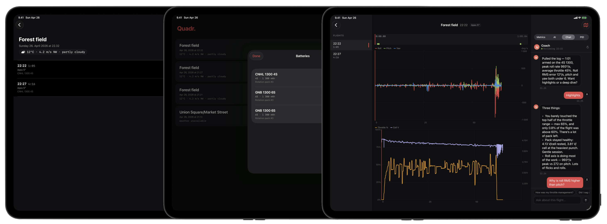

# Quadr.

> The fastest way to log FPV outings and review your Betaflight blackbox on iPad. On-device.

Quadr. is a flight diary for FPV pilots. Pair your flight controller's Bluetooth adapter, trigger MSC mode, plug in USB, and Quadr. pulls your blackbox files, parses them, and shows the gyro / setpoint / throttle / vbat traces alongside per-flight metrics and an AI coach. No accounts, no cloud, no manual file shuffling.

**App Store:** *coming soon*
**Requires:** iPad running iPadOS 18.1 or later. AI Coach features require an Apple Intelligence-capable iPad on iPadOS 26 or later.

---

## How it works

1. Start a **new outing**. Quadr. captures your spot location and the current weather snapshot.
2. Land. Open the **Auto-import** sheet — Quadr. talks to your FC's Bluetooth adapter (e.g. SpeedyBee BT) over BLE and triggers Mass Storage mode.
3. Plug the FC into your iPad over USB. Quadr. mounts the volume and pulls every new `.bbl` file into the outing.
4. Open a flight. Scrub the timeline, compare gyro to setpoint, and ask the AI Coach what to work on next.

Your blackbox files, location, and AI conversations stay on the device.

## Features

- BLE-triggered MSC + USB-mount auto-import — no laptop, no card reader, no SD card swap
- Per-flight charts: roll/pitch/yaw gyro vs setpoint, throttle %, vbat per cell, with a synced timeline scrubber and event markers (arming, punch-outs, sag spikes, peak-G)
- Metrics panel: throttle min/avg/max, cell voltage min/avg, peak G, RMS tracking error per axis, vibration peak frequency
- PID panel reads PIDs, rates, and filter settings from the blackbox header
- **AI Coach** chat — on-device Apple Intelligence reviews the flight, calls out what stood out, and answers follow-ups about throttle, sag, rates, or what to work on next
- Drone catalog auto-fills FC UID, firmware, and PIDs from your first imported flight per drone
- Battery catalog with per-pack rotation tracking
- Map view with the GPS track overlaid on the spot
- Outing diary: spot name, weather snapshot (temp, wind, gust, condition), flight count
- Load a **demo outing** with a real Betaflight blackbox flight if you want to explore before connecting hardware

## Privacy

Quadr. is designed so your flight data never leaves your device.

- No servers. No analytics. No tracking. No third-party SDKs.
- No accounts, no sign-in.
- AI Coach runs on-device using Apple Intelligence (Foundation Models) — your flight data and conversations are never sent to a remote model.
- Bluetooth access is used only to talk to your flight controller's BT adapter and trigger MSC mode.
- Location access is used once per outing to tag the spot, and to fetch the current weather snapshot.
- Photo library, microphone, and contacts are not used.

Full policy: [privacy.md](privacy.md)

## Support

Found a bug or have a feature request? Email **[hyper_anions_7g@icloud.com](mailto:hyper_anions_7g@icloud.com)**.

## License

© 2026 Juha Ylitalo. All rights reserved.
